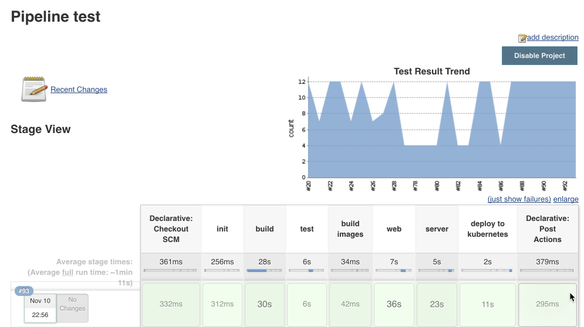

# Code Challenge
## Result
- Check [runtime](http://shorten.mashuo.io)
- Achieved CI/CD: git push will automatically trigger the whole build/test/deploy process, see: 

## Requirements
You have been asked to implement a URL shortening service, along the lines of something like tinyurl.com or bit.ly. Your service needs to be able to both take long URLs as input and shorten them, as well as being able to inflate a shortened URL to its original form.

Your solution should include all source code, including tests, hosted on something free and publicly accessible like GitHub. It should run on a service provider such as the free tiers provided by AWS or Azure (preferred). An easy deployment process to that environment would be a bonus. You have your choice of languages (although Node.js would be advantageous), IDEs, and frameworks.

### User Stories
* As a user, I want to shorten long url to short url so that I can put it in twitter;
* As a user, I want to recover shortened url back to long url so that I can visit the original site;
* As admin, I want to same long url will be generated the same short urls so that I can save system space;

## Analysis & Design
Use simple key & value to save, shortened url will be the key, and original Url will be the value. 

To simplify, I use the auto-grow integer as internal key, and then use simple algorithm to transfer the integer to key.

## Database
I use `sequelize` as the ORM, so it will support any kind of database sequelize supports.
one table called `url` with three columns: `id`, `originalUrl`, `shortenedUrl`.

## Implementations
### Technologies used
#### server
* `node.js` `express`
* `sequelize` with `sqlite`
* `jest` to test
#### client
* `react` with `redux`
* `recompose` 
* `jest` to test

## Deployment
### Azure Container Service (ACS) with kubernetes
- Azure Container Service (acs), and have two services:
  - shorten-server: with sqlite database running in memory
  - shorten-web
- Check [kubernetes config file](deploy/shorten-deploy.yml) 

### Use jenkins to achieve CI/CD
- Use jenkins pipeline with `Deploy to kubernates Plugin` and `Github plugin`
- Check [Jenkins pipeline file](deploy/Jenkinsfile)

## Known issues
- [ ] Need to improve the algorithm to avoid showing sequential for generated shortened url
- [ ] Does NOT support user provide shortened url
- [ ] Does NOT support databases cluster
- [ ] Using DNS A record which need manual operation if we delete pods in azure kubernetes
- [ ] UI has big room to improve
